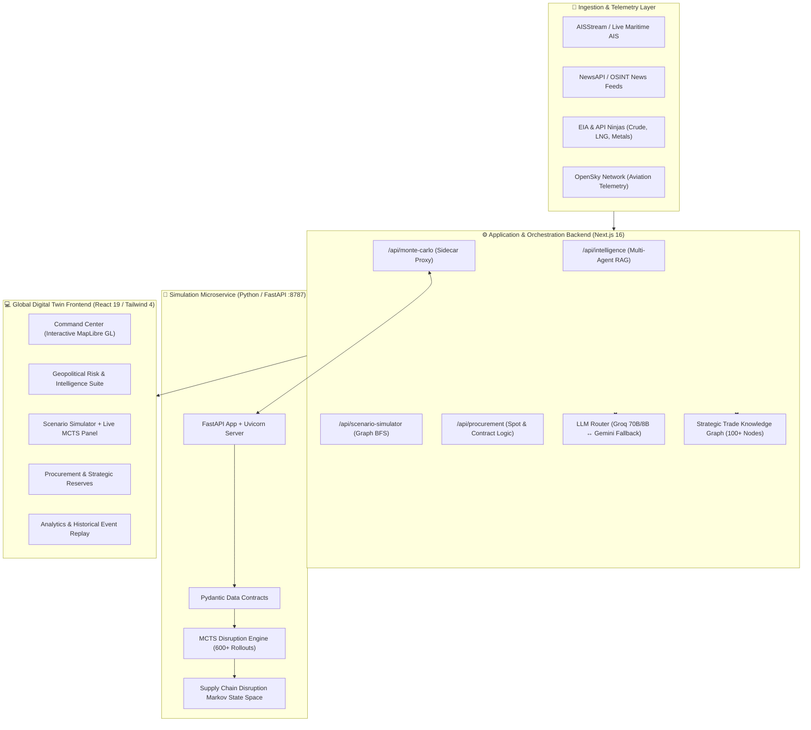

<div align="center">

# 🌐 Smart Supply Chain Analyst (SSCA)
### Global Supply Chain Intelligence & Monte Carlo Disruption Simulation Platform

[](https://nextjs.org/)
[](https://react.dev/)
[](https://www.typescriptlang.org/)
[](https://www.python.org/)
[](https://fastapi.tiangolo.com/)
[](https://groq.com/)
[](https://maplibre.org/)
[](https://tailwindcss.com/)
[](https://opensource.org/licenses/MIT)

<br />

**An enterprise-grade, real-time supply chain digital twin and intelligence engine.**  
Fusing real-time maritime AIS telemetry, live commodity feeds, geopolitical OSINT, a multi-jurisdiction trade knowledge graph, and a **Python-powered Monte Carlo Tree Search (MCTS) simulation engine** to forecast, trace, and mitigate global supply chain disruptions before they manifest in market prices.

</div>

---

## 📑 Table of Contents

- [Overview](#-overview)
- [Key Features](#-key-features)
- [Architecture & Tech Stack](#-architecture--tech-stack)
- [Monte Carlo Disruption Engine (MCTS)](#-monte-carlo-disruption-engine-mcts)
- [Core Platform Modules](#-core-platform-modules)
- [Knowledge Graph & BFS Propagation](#-knowledge-graph--bfs-propagation)
- [Getting Started](#-getting-started)
- [Environment Variables](#-environment-variables)
- [API Reference](#-api-reference)
- [Project Structure](#-project-structure)
- [Troubleshooting](#-troubleshooting)
- [License](#-license)

---

## 🎯 Overview

Global supply chains are non-linear networks vulnerable to cascading failures across maritime choke points, refining clusters, and multi-tier supplier dependencies. When a regional conflict intensifies near the Strait of Hormuz, a maritime blockage halts the Strait of Malacca, or export controls restrict semiconductor wafers:

1. **Signal Fusion:** Ingests live AIS vessel tracking, breaking news OSINT, commodity spot prices, and strategic reserves.
2. **Graph Traversal:** Executes BFS topological propagation across multi-national trade dependencies, identifying vulnerable corridors, commodities, ports, and downstream industries.
3. **MCTS Simulation:** Dispatches high-iteration Monte Carlo rollouts through a Python FastAPI microservice to dynamically calibrate disruption severity %, economic stress, escalation probability, and optimal counter-actions.
4. **Agentic AI Synthesis:** Orchestrates 5 parallel LLM reasoning modules (Groq LLaMA 3.1 70B/8B with automatic Gemini fallback) to draft executive briefings, alternative supplier allocations, and operational hedging strategies.

---

## ⚡ Key Features

| Capability | Technical Implementation | Impact |
|:---|:---|:---|
| **Live Geopolitical Intelligence** | Multi-agent RAG pipeline powered by Groq LLaMA 3.1 & Gemini 2.5 Flash | Real-time structured risk assessments with automated corroboration & citations |
| **Monte Carlo Disruption Engine** | Standalone Python FastAPI microservice running 600+ MCTS rollouts | Computes dynamic severity %, escalation risk, economic stress & optimal response actions |
| **Global Digital Twin Map** | MapLibre GL 5 + WebSockets + AIS vessel tracking | Interactive 3D/2D visualization of global choke points, trade corridors, and active fleets |
| **Topological Disruption Propagation** | Multi-hop Breadth-First Search (BFS) graph traversal across 100+ nodes | Quantifies systemic supply deficits, capacity loss, and recovery time estimates |
| **Multi-Jurisdiction Profiles** | Dynamic country & regional selector (Singapore, India, Regional Hubs) | Localized energy dependency metrics, import baskets, reserve buffers, and port routes |
| **Adaptive Procurement & Reserves** | Live EIA & API Ninjas spot pricing + Strategic Petroleum Reserve (SPR) tracker | Real-time supplier exposure scoring, spot price tracking, and buffer drawdown models |

---

## 🏗️ Architecture & Tech Stack

The platform is architected as a high-performance **dual-stack system** combining Next.js 16 (App Router) on Node.js with an asynchronous Python FastAPI microservice acting as the Monte Carlo simulation oracle.



### Full Tech Stack Breakdown

- **Frontend & App Framework:** Next.js 16.2 (App Router), React 19.2, TypeScript 5.0, Tailwind CSS 4.0, Framer Motion 12, Three.js / React Force Graph 3D, Recharts, Lucide Icons.
- **Geospatial & Visualization:** MapLibre GL 5.24, TopoJSON Client, World Atlas.
- **Python Simulation Microservice:** Python 3.10+, FastAPI 0.111+, Uvicorn 0.29+, Pydantic 2.0+ (`simulation-engine/`).
- **AI & NLP Orchestration:** Groq SDK (`llama-3.3-70b-versatile`, `llama-3.1-8b-instant`), Google Gemini API fallback (`gemini-2.5-flash`), Zod Schema Validation.
- **Data Integrations:** AISStream WebSocket API, NewsAPI, EIA Open Data API, API Ninjas Energy Commodities, OpenSky Network API.

---

## 🎲 Monte Carlo Disruption Engine (MCTS)

Rather than relying purely on static heuristic percentages, SSCA incorporates a **Monte Carlo Tree Search (MCTS)** disruption engine implemented in Python (`simulation-engine/monte_carlo_server.py`).

### How It Works

```
Disruption Trigger (e.g., Strait of Hormuz 65% Severity)
       │
       ▼
[ Python FastAPI Microservice :8787 ]
       │
       ├── Phase State Transitions:
       │   [ Trigger ] ──► [ Triage ] ──► [ Rerouting ] ──► [ Capacity-Rebuild ] ──► [ Resolution ]
       │
       ├── Multi-Armed Bandit / UCB1 Node Selection (600 Iterations)
       │   - Balance exploration vs exploitation of mitigation actions
       │   - Candidate actions: reserve-logistics, strategic-rerouting, bilateral-waiver, etc.
       │
       ├── Stochastic Rollouts:
       │   - Economic Stress Index
       │   - Geopolitical Escalation Probability
       │   - Negotiation Feasibility Score
       │
       ▼
Dynamic Recalibrated Severity % + Action Confidence Distribution
       │
       ▼
Injected into Next.js Graph Propagation Engine (Zero-downtime fallback to static if offline)
```

### Key Output Metrics

- **Dynamic Severity %:** Recalibrated baseline severity derived from tree node visits and outcome rewards across state spaces.
- **Escalation Probability (%):** Probability that regional military or diplomatic tension escalates into prolonged blockade.
- **Economic Stress (%):** Aggregated freight rate surge, insurance war-risk premiums, and alternative routing friction.
- **Optimal Counter-Action:** Recommended logistical or geopolitical lever (e.g. `reserve-logistics`, `diplomatic-escort-convoy`).
- **Phase Visit Distribution:** Histogram of rollout time spent across `trigger`, `triage`, `rerouting`, `capacity-rebuild`, and `resolution` phases.

---

## 🧩 Core Platform Modules

```
┌────────────────────────────────────────────────────────────────────────────────────────────────────────┐
│                                       PLATFORM MODULE ECOSYSTEM                                        │
├────────────────────────────┬────────────────────────────┬────────────────────────────┬─────────────────┤
│ 🌍 Geopolitical Risk       │ 🗺️ Command Center         │ 🎮 Scenario Simulator      │ 📦 Procurement  │
│ Multi-source OSINT news,   │ Real-time global maritime  │ Monte Carlo Tree Search    │ Spot prices,    │
│ AIS anomaly correlation,   │ vessel tracking, corridor  │ stress-testing, graph BFS  │ contract risk,  │
│ 5-agent AI report synthesis│ health, risk zone overlays │ propagation, policy levers │ buffer modeling │
├────────────────────────────┼────────────────────────────┼────────────────────────────┼─────────────────┤
│ 🔬 Refinery & Processing   │ 🛢️ Strategic Reserves     │ 📊 Analytics & Trends      │ ⚡ Live Alerts  │
│ Global refining capacity,  │ Petroleum buffer reserves, │ Historical commodity flux, │ Real-time event │
│ throughput, crude diets,   │ drawdown simulations, and  │ freight spot correlations, │ feed & priority │
│ product export pipelines   │ strategic autonomy metrics │ vulnerability indices      │ notifications   │
└────────────────────────────┴────────────────────────────┴────────────────────────────┴─────────────────┘
```

---

## 🗺️ Knowledge Graph & BFS Propagation

The intelligence layer is grounded in a deterministic multi-country trade knowledge graph comprising over 100 strategic nodes:

- **Strategic Corridors:** Strait of Hormuz, Strait of Malacca, Suez Canal, Bab-el-Mandeb, South China Sea, Cape of Good Hope, Panama Canal, Taiwan Strait.
- **Critical Commodities:** Crude Oil (Arab Light, Basrah, Urals), LNG, Semiconductor Silicon, Pharma APIs, Rare Earths, Fertilizers, Palm Oil, Coking Coal.
- **Major Ports & Infrastructure:** Singapore (Jurong, Bukom), Mumbai (JNPT), Mundra, Rotterdam, Jebel Ali, Shanghai, Ningbo-Zhoushan, Busan, Houston.
- **Downstream Industries:** Petroleum Refining, Petrochemicals, Power Generation, Semiconductor Fab, Active Pharmaceutical Ingredients, Automotive, Agriculture.

### Supply Chain Reasoning Chain

When an intelligence alert or scenario is processed:
1. **Entity Resolution:** Alias matching resolves entities from raw intelligence signals into graph nodes.
2. **K-Hop BFS Traversal:** Traverses from origin nodes through corridors, commodities, and downstream industrial hubs.
3. **Alternative Supplier Mapping:** Resolves alternative routes and replacement sourcing vectors with latency and tariff penalties.
4. **Zod Validation:** Formats and strictly validates output payloads into structured TypeScript models.

---

## 🚀 Getting Started

### Prerequisites

- **Node.js:** `18.x` or higher (Node 20+ recommended)
- **npm:** `9.x` or higher
- **Python:** `3.10` or higher (required for the MCTS Simulation Engine)
- **Git:** Installed and configured

---

### Step 1: Clone the Repository

```bash
git clone https://github.com/Abbas-sp3/Smart-Supply-Chain-Analyst.git
cd Smart-Supply-Chain-Analyst
```

### Step 2: Install Node & Python Dependencies

```bash
# 1. Install Node.js dependencies
npm install

# 2. Install Python dependencies (FastAPI, Uvicorn, Pydantic)
npm run mc:install
```

### Step 3: Configure Environment Variables

Create a `.env.local` file in the root directory:

```bash
cp .env.example .env.local
```

Populate the keys in `.env.local` (see [Environment Variables](#-environment-variables) below for details).

### Step 4: Run the Dual-Stack Platform

Start both the Next.js frontend application and the Python Monte Carlo Risk Server in a single unified terminal:

```bash
npm run dev:full
```

This launches:
- **Next.js Web Application:** `http://localhost:3000`
- **Python MCTS Risk Server:** `http://localhost:8787` (Health: `http://localhost:8787/health`)

> **Zero-Downtime Design:** If the Python server is not started, the application automatically and gracefully falls back to deterministic static models without interrupting user workflows.

### Alternative Execution Options

```bash
# Run only Next.js (uses static severity fallback)
npm run dev

# Run only the Python Monte Carlo Server
npm run mc
```

---

## 🔑 Environment Variables

| Variable | Required | Description | Provider / Link |
|:---|:---:|:---|:---|
| `GROQ_API_KEY` | **Yes** | Primary LLM inference for 5-agent RAG pipeline (LLaMA 3.1 70B/8B) | [console.groq.com](https://console.groq.com/) |
| `GEMINI_API_KEY` | Recommended | Automatic fallback LLM when Groq reaches token or rate limits | [aistudio.google.com](https://aistudio.google.com/) |
| `AISSTREAM_API_KEY` | Recommended | Real-time global maritime AIS vessel telemetry | [aisstream.io](https://aisstream.io/) |
| `NEWS_API_KEY` | Optional | Live geopolitical and trade news articles (mock data used if absent) | [newsapi.org](https://newsapi.org/) |
| `EIA_API_KEY` | Optional | Brent and WTI spot prices in the Procurement module | [eia.gov/opendata](https://www.eia.gov/opendata/) |
| `API_NINJAS_KEY` | Optional | Global energy commodity spot pricing (LNG, Coal, Natural Gas) | [api-ninjas.com](https://api-ninjas.com/) |
| `OPENSKY_CLIENT_ID` | Optional | Military and civil aviation monitoring OAuth client | [opensky-network.org](https://opensky-network.org/) |
| `OPENSKY_CLIENT_SECRET` | Optional | OpenSky Network OAuth secret | [opensky-network.org](https://opensky-network.org/) |
| `MONTE_CARLO_SERVER_URL` | Optional | URL of the Python MCTS backend (Default: `http://localhost:8787`) | Local Microservice |

---

## 📡 API Reference

### 1. Geopolitical Intelligence
`POST /api/intelligence`
- **Request Body:** `{ countryId?: string, forceRefresh?: boolean }`
- **Response:** Fully structured, gap-filled, and Zod-validated `IntelligenceReport` object.

### 2. Monte Carlo Simulation Engine
`POST /api/monte-carlo`
- **Request Body:** `{ presetId: string, category?: string, severityPct?: number, iterations?: number }`
- **Response:** MCTS metrics including `severity_pct`, `escalation_pct`, `economic_stress_pct`, `best_action`, and `phase_distribution`.

### 3. Scenario Simulator
`POST /api/scenario-simulator`
- **Request Body:** `{ presetId: string, activeLeverIds?: string[], mcSeverityPct?: number, countryId?: string }`
- **Response:** Topological BFS propagation results, affected node cascading scores, duration bounds, and supply deficits.

### 4. Energy Procurement & Prices
`GET /api/procurement?countryId=singapore`
- **Response:** Real-time spot pricing, supplier risk scores, alternative supplier matching, and contract exposure matrices.

### 5. Maritime AIS Vessels
`GET /api/ships`
- **Response:** Normalized active vessel fleet coordinates, vessel types, destinations, and speed over ground.

---

## 📂 Project Structure

```
Smart-Supply-Chain-Analyst/
├── simulation-engine/                   # 🧠 Python MCTS Simulation Engine
│   ├── monte_carlo_server.py           # Standalone FastAPI MCTS service
│   ├── requirements.txt                # Python dependencies (FastAPI, Uvicorn, Pydantic)
│   └── START_MONTE_CARLO.ps1           # Windows PowerShell launch utility
│
├── src/
│   ├── app/                            # Next.js App Router
│   │   ├── (dashboard)/                # Dashboard views & API endpoints
│   │   │   ├── api/
│   │   │   │   ├── intelligence/       # Multi-agent RAG intelligence endpoint
│   │   │   │   ├── monte-carlo/        # Python MCTS sidecar proxy
│   │   │   │   ├── scenario-simulator/ # Disruption propagation endpoint
│   │   │   │   ├── procurement/        # Procurement spot pricing endpoint
│   │   │   │   └── ships/              # AIS vessel stream endpoint
│   │   │   ├── layout.tsx              # Dashboard layout shell
│   │   │   └── page.tsx                # Main view router
│   │
│   ├── components/                     # Core UI component library
│   │   ├── map/                        # MapLibre GL 5 interactive layers & ship renderers
│   │   ├── dashboard-page/             # Modular dashboard layouts
│   │   └── ui/                         # Base UI & Radix primitives
│   │
│   ├── data/                           # Multi-country baseline data & knowledge graphs
│   │   ├── countries/                  # Multi-country configurations (Singapore, India, etc.)
│   │   └── strategic-trade-graph.json  # Global strategic trade network definition
│   │
│   ├── features/                       # Domain feature modules
│   │   ├── geopolitical-intelligence/  # Agentic RAG engine, prompts & Zod schemas
│   │   ├── scenario-simulator/         # Scenario modelling & Monte Carlo UI panels
│   │   ├── geopolitical-risk/          # Regional risk heatmap layers
│   │   ├── procurement/                # Supplier contracts & spot monitors
│   │   ├── refinery/                   # Refinery throughput & crude diet tracking
│   │   ├── strategic-reserve/          # Strategic petroleum reserve drawdown models
│   │   └── analytics/                  # Historical trends & vulnerability indices
│   │
│   ├── lib/                            # Shared libraries & WebSocket managers
│   └── services/                       # Multi-LLM routers & data provider adapters
│
├── package.json                        # Node.js project scripts & dependencies
├── tsconfig.json                       # TypeScript compiler configuration
└── README.md                           # Enterprise documentation
```

---

## 🛠️ Troubleshooting

| Issue | Root Cause | Resolution |
|:---|:---|:---|
| **Monte Carlo shows "Static severity (offline)"** | Python server not running on port `8787` | Run `npm run dev:full` or execute `npm run mc` in a separate terminal. |
| **Python dependencies missing** | `fastapi` or `uvicorn` not installed | Run `npm run mc:install` or execute `pip install -r simulation-engine/requirements.txt`. |
| **Intelligence report generation fails** | Invalid or missing `GROQ_API_KEY` | Verify API key at [console.groq.com](https://console.groq.com/) and check `.env.local`. |
| **Rate limit reached on primary AI** | Groq hourly request ceiling hit | Add `GEMINI_API_KEY` in `.env.local` to enable automatic seamless failover. |
| **Map shows no live vessels** | `AISSTREAM_API_KEY` not configured | Register for a free WebSocket stream key at [aisstream.io](https://aisstream.io/). |
| **TypeScript compilation errors** | Stale node_modules or cache | Run `npx tsc --noEmit` to identify issues or reinstall with `npm install`. |

---

## 📄 License

This project is licensed under the **MIT License** — see the [LICENSE](LICENSE) file for full details.

<div align="center">
<sub>Built for global supply chain leaders, trade analysts, and enterprise logistics planners.</sub>
</div>