<div align="center">

<br />

```
╔═══════════════════════════════════════════════════════════════╗
â•‘                                                               â•‘
║     ███████╗███████╗ ██████╗ █████╗                          ║
║     ██╔════╝██╔════╝██╔════╝██╔══██╗                         ║
║     ███████╗███████╗██║     ███████║                         ║
║     ╚════██║╚════██║██║     ██╔══██║                         ║
║     ███████║███████║╚██████╗██║  ██║                         ║
║     ╚══════╝╚══════╝ ╚═════╝╚═╝  ╚═╝                         ║
â•‘                                                               â•‘
â•‘         Smart Supply Chain Analyst                            â•‘
â•‘         Global Supply Chain Intelligence Platform                  â•‘
â•‘                                                               â•‘
╚═══════════════════════════════════════════════════════════════╝
```

<br />

[](https://nextjs.org/)
[](https://react.dev/)
[](https://www.typescriptlang.org/)
[](https://groq.com/)
[](https://maplibre.org/)
[](https://tailwindcss.com/)

<br />

**A real-time supply chain intelligence platform for the global import ecosystem (focusing on Singapore, India, and critical hubs).**  
Tracking global trade corridors, geopolitical risk, maritime activity, refinery operations,  
and procurement intelligence — all fused into a single enterprise-grade dashboard.

<br />

</div>

---

## What It Does

SSCA monitors every layer of global import supply chains simultaneously. When a conflict breaks out near the Strait of Hormuz, a cyclone hits a major port, or China restricts rare earth exports, the platform instantly traces the ripple effect across India's energy, pharma, electronics, and agriculture sectors — and recommends what to do about it.

```
┌─────────────────────────────────────────────────────────────────────┐
│                    INTELLIGENCE FLOW                                │
│                                                                     │
│  Global Events ──► Signal Collection ──► AI Reasoning Engine        │
│                                               │                     │
│   • News feeds         • NewsAPI              │  Groq LLaMA 3.1    │
│   • AIS maritime       • AISStream            │  + Gemini fallback  │
│   • Military aviation  • OpenSky Network      │                     │
│                               │               ▼                     │
│                        Knowledge Graph   5 Parallel Modules         │
│                        (101 trade       ┌──────────────────┐       │
│                         nodes)           │ Executive Summary│       │
│                               │          │ Supply Chain Map │       │
│                               ▼          │ Recommendations  │       │
│                        Structured        │ Scenario Analysis│       │
│                        Context           │ Evidence         │       │
│                                          └──────────────────┘       │
│                                                 │                   │
│                                                 ▼                   │
│                                    Unified Intelligence Report      │
│                                    (Validated, Gap-Filled, Served)  │
└─────────────────────────────────────────────────────────────────────┘
```

---

## Platform Modules

```
┌──────────────────┬───────────────────┬───────────────────┬──────────────────┐
│                  │                   │                   │                  │
│  🌍 GEOPOLITICAL │  🗺️  COMMAND      │  📊 ANALYTICS     │  🔬 REFINERY     │
│   RISK           │   CENTER          │                   │   & PROCESSING   │
│                  │  Real-time AIS    │  Historical trade │                  │
│  Tracks global   │  vessel tracking  │  flow charts,     │  Tracks India's  │
│  events and      │  overlaid on a    │  commodity price  │  refinery        │
│  reasons through │  geopolitical     │  trends, and      │  capacity,       │
│  their impact    │  risk map of      │  corridor health  │  throughput,     │
│  on India's      │  India's trade    │  indices          │  and crude       │
│  imports         │  corridors        │                   │  intake          │
│                  │                   │                   │                  │
├──────────────────┼───────────────────┼───────────────────┼──────────────────┤
│                  │                   │                   │                  │
│  📦 ENERGY       │  🛢️  ENERGY       │  🎮 SCENARIO      │  ⚡ REAL-TIME    │
│   PROCUREMENT    │   RESERVES        │   SIMULATOR       │   ALERTS         │
│                  │                   │                   │                  │
│  Tracks supplier │  Monitors India's │  Monte Carlo Tree │  Live event feed │
│  risk, contract  │  strategic oil,   │  Search models for       │  with priority   │
│  exposure, and   │  sourcing, and    │  port closure,    │  classification  │
│  sourcing        │  reserve levels   │  sanctions, route │  and supply      │
│  alternatives    │                   │  deviation        │  chain impact    │
│                  │                   │                   │                  │
└──────────────────┴───────────────────┴───────────────────┴──────────────────┘
```

---

## Geopolitical Intelligence Engine

The core of the platform. It reasons like a senior analyst — not a news aggregator.

```
INPUT SOURCES
─────────────
NewsAPI ──────────────────────┐
AISStream (Maritime) ─────────┤──► Fact Extraction (LLaMA 3.1 8B)
OpenSky (Military Aviation) ──┘               │
                                              │
                                              â–¼
                              ┌───────────────────────────┐
                              │   KNOWLEDGE GRAPH ENGINE   │
                              │                           │
                              │  101 trade nodes        │
                              │  29 source countries    │
                              │  23 critical products   │
                              │  Major global ports (Singapore, India, etc.)        │
                              │  8 strategic corridors  │
                              │  15 industries          │
                              │  8 infrastructure nodes │
                              │                           │
                              │  BFS Supply Chain Trace   │
                              │  Event → Countries →      │
                              │  Routes → Products →      │
                              │  Industries → Ports →     │
                              │  Infrastructure →         │
                              │  Alternatives             │
                              └────────────┬──────────────┘
                                           │
                              ┌────────────▼──────────────┐
                              │   EVIDENCE FUSION ENGINE   │
                              │                           │
                              │  Cross-source signals     │
                              │  37 strategic keywords    │
                              │  Confidence: Strong /     │
                              │  Moderate / Weak          │
                              └────────────┬──────────────┘
                                           │
                    ┌──────────────────────▼───────────────────────┐
                    │         5 PARALLEL GROQ MODULES               │
                    │                                               │
                    │  ① Executive Summary    ② Supply Chain Impact│
                    │  ③ Recommendations      ④ Scenario Analysis  │
                    │                 ⑤ Evidence                   │
                    │                                               │
                    │  Each module receives:                        │
                    │  • Pre-computed supply chain exposure (KG)    │
                    │  • Corroborated evidence signals              │
                    │  • Strategic context summary                  │
                    └──────────────────────┬───────────────────────┘
                                           │
                              ┌────────────▼──────────────┐
                              │     REPORT ASSEMBLER       │
                              │   + GAP-FILL FROM KG       │
                              │                           │
                              │  Fills empty sections     │
                              │  from knowledge graph     │
                              │  when LLM misses them     │
                              └────────────┬──────────────┘
                                           │
                              ┌────────────▼──────────────┐
                              │   ZOD SCHEMA VALIDATION    │
                              │   Typed IntelligenceReport │
                              └───────────────────────────┘
```

### Supply Chain Reasoning Chain

Every intelligence observation follows this exact reasoning path:

```
â‘  WHAT HAPPENED?
      │
      â–¼
② WHICH COUNTRIES?  ──────────────────────────────────────────────────┐
      │                                                               │
      â–¼                                                               â–¼
â‘¢ WHICH TRADE CORRIDORS?            Alternative Suppliers Mapped For Each
   Hormuz · Malacca · Suez ·        Disrupted Product
   Bab-el-Mandeb · Black Sea
      │
      â–¼
â‘£ WHICH PRODUCTS / COMMODITIES?
   Crude Oil · LNG · APIs · Semiconductors ·
   Rare Earths · Fertilizers · Palm Oil...
      │
      â–¼
⑤ WHICH IMPORT CATEGORIES?
   Energy · Minerals · Pharma · Electronics ·
   Agriculture · Defence · Industrial
      │
      â–¼
â‘¥ WHICH INDIAN INDUSTRIES?
   Refining · Pharma · Electronics · Automotive ·
   Power · Agriculture · Defence · Chemicals...
      │
      â–¼
⑦ WHICH INDIAN PORTS?
   JNPT · Mundra · Kandla · Chennai ·
   Vizag · Kochi · Kolkata · Mangalore...
      │
      â–¼
⑧ WHAT CRITICAL INFRASTRUCTURE IS AT RISK?
   Refineries · Power Grid · Fertilizer Plants ·
   Pharma Clusters · Electronics Assembly Zones
      │
      â–¼
⑨ OPERATIONAL RECOMMENDATION
      │
      â–¼
â‘© INDIA IMPORT IMPACT STATEMENT
```

---

## Tech Stack

```
┌─────────────────────────────────────────────────────────┐
│  FRONTEND                                               │
│  ┌───────────┐  ┌───────────┐  ┌───────────────────┐   │
│  │  Next.js  │  │  React    │  │   Tailwind CSS 4  │   │
│  │   16.2    │  │   19      │  │   + Framer Motion │   │
│  └───────────┘  └───────────┘  └───────────────────┘   │
│  ┌───────────────────┐  ┌────────────────────────────┐  │
│  │  MapLibre GL 5    │  │  Lucide Icons + shadcn/ui  │  │
│  │  (Interactive Map)│  │                            │  │
│  └───────────────────┘  └────────────────────────────┘  │
├─────────────────────────────────────────────────────────┤
│  AI / LLM LAYER                                         │
│  ┌───────────────────┐  ┌────────────────────────────┐  │
│  │  Groq (Primary)   │  │  Google Gemini (Fallback)  │  │
│  │  LLaMA 3.1 70B    │  │  Automatic failover on     │  │
│  │  LLaMA 3.1 8B     │  │  rate limits / errors      │  │
│  └───────────────────┘  └────────────────────────────┘  │
├─────────────────────────────────────────────────────────┤
│  DATA SOURCES                                           │
│  ┌──────────┐  ┌──────────────┐  ┌──────────────────┐  │
│  │ NewsAPI  │  │  AISStream   │  │  OpenSky Network  │  │
│  │ (news)   │  │ (maritime)   │  │  (mil. aviation)  │  │
│  └──────────┘  └──────────────┘  └──────────────────┘  │
├─────────────────────────────────────────────────────────┤
│  VALIDATION & SCHEMA                                    │
│  ┌───────────────────────────────────────────────────┐  │
│  │  Zod — every LLM response validated before use   │  │
│  └───────────────────────────────────────────────────┘  │
└─────────────────────────────────────────────────────────┘
```

---

## Project Structure

```
src/
├── app/                        # Next.js App Router pages & API routes
│   └── api/
│       ├── intelligence/       # Geopolitical intelligence endpoint
│       ├── ships/              # Live AIS vessel data endpoint
│       └── ...
│
├── components/                 # UI components
│   ├── dashboard-page/         # Main dashboard layout
│   ├── dashboard-kpi-row/      # Top KPI metric cards
│   ├── dashboard-alerts-table/ # Priority alerts panel
│   ├── dashboard-event-feed/   # Live event stream
│   ├── map/                    # MapLibre interactive map
│   │   └── ships/              # AIS vessel layer
│   ├── home-hero/              # Landing page hero
│   ├── home-module-grid/       # Module navigation grid
│   └── ui/                     # Shared UI primitives
│
├── features/                   # Domain feature modules
│   ├── geopolitical-intelligence/   # ★ Core intelligence engine
│   │   ├── knowledge-graph/         # 101 node trade graph + BFS tracer
│   │   ├── modules/                 # 5 independent Groq AI modules
│   │   ├── prompts/                 # Supply-chain-first LLM prompts
│   │   ├── schemas/                 # Zod validation schemas
│   │   ├── services/                # Orchestration, preprocessing, assembly
│   │   └── types/                   # TypeScript types
│   ├── geopolitical-risk/           # Risk scoring & map overlay
│   ├── analytics/                   # Charts & historical analysis
│   ├── refinery/                    # Refinery capacity monitor
│   ├── procurement/                 # Supplier & contract intelligence
│   ├── strategic-reserve/           # Reserve level tracking
│   ├── scenario-simulator/          # What-if scenario modelling
│   └── historical-replay/           # Historical event playback
│
├── lib/
│   └── aisstream/              # WebSocket AIS vessel manager
│
└── services/
    ├── llm/                    # LLM router (Groq → Gemini fallback)
    └── shipService.ts          # Ship data service
```

---

## Getting Started

### Prerequisites

Make sure you have the following installed:

| Tool | Version | Link |
|------|---------|------|
| Node.js | 18.x or higher | [nodejs.org](https://nodejs.org/) |
| npm | 9.x or higher | Included with Node.js |
| Git | Any | [git-scm.com](https://git-scm.com/) |

---

### Step 1 — Clone the Repository

```bash
git clone https://github.com/your-username/smart-supply-chain-analyst.git
cd smart-supply-chain-analyst
```

---

### Step 2 — Install Dependencies

```bash
npm install
```

---

### Step 3 — Configure Environment Variables

Copy the example env file and fill in your API keys:

```bash
cp .env.example .env.local
```

Then open `.env.local` and fill in the values:

```env
# ── REQUIRED ──────────────────────────────────────────────────
# Groq — Primary AI engine (free tier available)
# Get your key at: https://console.groq.com/
GROQ_API_KEY=gsk_...

# ── RECOMMENDED ───────────────────────────────────────────────
# Google Gemini — Fallback LLM when Groq hits rate limits
# Get your key at: https://aistudio.google.com/apikey
GEMINI_API_KEY=AI...

# AISStream — Live vessel tracking on the map
# Get your key at: https://aisstream.io/
AISSTREAM_API_KEY=...

# ── OPTIONAL ──────────────────────────────────────────────────
# NewsAPI — Live news for intelligence engine (uses curated mock data if missing)
# Get your key at: https://newsapi.org/
NEWS_API_KEY=...

# EIA — Crude oil spot prices (Brent/WTI) in the Procurement module
# Get your key at: https://www.eia.gov/opendata/register.php
EIA_API_KEY=...

# API Ninjas — Live energy commodity prices (LNG, coal, gas, etc.)
# Get your key at: https://api-ninjas.com/
API_NINJAS_KEY=...

# OpenSky Network — Military aviation intelligence (optional)
# Get credentials at: https://opensky-network.org/
OPENSKY_CLIENT_ID=
OPENSKY_CLIENT_SECRET=
```

> **Minimum to run:** Only `GROQ_API_KEY` is strictly required. Everything else gracefully falls back to curated mock data so the platform always has something to analyse.

---

### Step 4 — Start the Development Server

```bash
npm run dev
```

Open [http://localhost:3000](http://localhost:3000) in your browser.

---

### Step 5 — Generate Your First Intelligence Report

1. Navigate to the **Geopolitical Intelligence** module from the home screen
2. Click **"Generate Intelligence Report"**
3. Wait ~15–30 seconds for the AI to run all 5 analysis modules
4. The dashboard populates with full supply chain intelligence

---

## API Keys — Where to Get Them

```
┌──────────────────┬─────────────────────────────┬────────────┬───────────────┐
│  Key             │  What it powers              │  Free Tier │  Sign-up      │
├──────────────────┼─────────────────────────────┼────────────┼───────────────┤
│  GROQ_API_KEY    │  AI intelligence engine      │  ✅ Yes    │  console.groq │
│                  │  (primary LLM)               │            │  .com         │
├──────────────────┼─────────────────────────────┼────────────┼───────────────┤
│  GEMINI_API_KEY  │  AI fallback when Groq is    │  ✅ Yes    │  aistudio     │
│                  │  rate limited                │            │  .google.com  │
├──────────────────┼─────────────────────────────┼────────────┼───────────────┤
│  AISSTREAM_      │  Live ship tracking on       │  ✅ Yes    │  aisstream    │
│  API_KEY         │  the map                     │            │  .io          │
├──────────────────┼─────────────────────────────┼────────────┼───────────────┤
│  NEWS_API_KEY    │  Live geopolitical news      │  ✅ Yes    │  newsapi.org  │
│                  │  (mock data used if missing) │            │               │
├──────────────────┼─────────────────────────────┼────────────┼───────────────┤
│  OPENSKY_*       │  Military aviation signals   │  ✅ Yes    │  opensky-     │
│                  │  for intelligence engine     │            │  network.org  │
├──────────────────┼─────────────────────────────┼────────────┼───────────────┤
│  EIA_API_KEY     │  Brent/WTI crude oil spot    │  ✅ Yes    │  eia.gov/     │
│                  │  prices in Procurement       │            │  opendata     │
├──────────────────┼─────────────────────────────┼────────────┼───────────────┤
│  API_NINJAS_KEY  │  Live LNG, gas, coal prices  │  ✅ Yes    │  api-ninjas   │
│                  │  in Procurement module       │            │  .com         │
└──────────────────┴─────────────────────────────┴────────────┴───────────────┘
```

---

## How the AI Works

### LLM Router — Automatic Failover

```
Request comes in
      │
      â–¼
  Groq API ──── success ──► Return response
      │
    fails / rate limited
      │
      â–¼
  Gemini API ── success ──► Return response
      │
    fails
      │
      â–¼
   Error thrown (both LLMs unavailable)
```

### Module Caching Strategy

```
                    ┌─────────────────────────────────────────┐
                    │         Cache TTL per Module             │
                    │                                         │
                    │  Executive Summary   ──  30 min         │
                    │  Supply Chain Impact ──  30 min         │
                    │  Recommendations     ──  30 min         │
                    │  Scenario Analysis   ──  Context hash*  │
                    │  Evidence            ──  30 min         │
                    │                                         │
                    │  * Scenario module invalidates when     │
                    │    the intelligence context changes,    │
                    │    not on a fixed timer                 │
                    └─────────────────────────────────────────┘
```

Each of the 5 modules caches independently. If news is stale but a new maritime alert arrives, only the modules whose context hash changed are re-run.

---

## Knowledge Graph

The intelligence engine is backed by a static strategic knowledge graph of the global import ecosystem (focusing on Singapore, India, and critical hubs) — 101 nodes representing real trade relationships, not invented by the AI.

```
                    KNOWLEDGE GRAPH NODE TYPES
                    ──────────────────────────

  🌍 Countries          🚢 Corridors         🏭 Products
  ─────────────         ────────────         ──────────
  Iraq (23% crude)      Hormuz               Crude Oil
  Saudi Arabia          Malacca              LNG / LPG
  China                 Suez                 Semiconductors
  Russia                Bab-el-Mandeb        Rare Earths
  Indonesia             South China Sea      Pharma APIs
  Qatar                 Black Sea            Fertilizers
  Australia             Panama               Solar Panels
  Taiwan                Cape of Good Hope    Palm Oil
  + 22 more...                               + 12 more...

  🚢 Indian Ports       🏗️ Industries        🏭 Infrastructure
  ───────────────       ─────────────        ─────────────────
  JNPT                  Petroleum Refining   West Coast Refineries
  Mundra                Pharmaceuticals      East Coast Refineries
  Kandla                Electronics Mfg      National Power Grid
  Chennai               Automotive           Pharma Clusters
  Vizag                 Power Generation     Fertilizer Plants
  Kochi                 Agriculture          Electronics Zones
  Kolkata               Steel Production     (TN, Noida)
  + 5 more...           + 7 more...
```

When an event is detected (e.g., "Houthi attack in Red Sea"), the graph engine:
1. Matches all entity aliases in the intelligence text
2. Runs BFS traversal (3 hops) from matched nodes
3. Traces: Corridor → Products → Categories → Industries → Ports → Infrastructure
4. Resolves alternative suppliers for disrupted products
5. Delivers deterministic context to the AI — so it reasons with facts, not guesses

---

## Architecture

```mermaid
graph TD
    %% 1. Data Ingestion Layer
    subgraph "External Data & Signals (Ingestion Layer)"
        NewsAPI["Geopolitical News Feeds (NewsAPI)"]
        AISData["Live Maritime AIS Data (Simulated)"]
        CommodityData["Spot Market Prices (Simulated)"]
        ReservesData["Strategic Petroleum Reserves (PPAC Baseline)"]
    end

    %% 2. Agentic AI & Processing Engine Layer
    subgraph "AI & Analytics Engine (Backend Layer)"
        RAGAgent["Geopolitical Risk Agent (RAG Pipeline)"]
        LLM["Groq / LLaMA-3 (NLP Extraction & Analysis)"]
        Simulator["Disruption Scenario Modeller (BFS Graph)"]
        ProcurementOrch["Adaptive Procurement Orchestrator"]
        ReserveOpt["Strategic Reserve Optimisation Agent"]
        
        %% Internal links within Backend
        NewsAPI --> RAGAgent
        RAGAgent <--> LLM
        AISData --> Simulator
        CommodityData --> ProcurementOrch
        ReservesData --> ReserveOpt
        Simulator --> ReserveOpt
    end

    %% 3. Strategic Intelligence Synthesis Layer
    subgraph "Strategic Intelligence Layer (Cross-Module Synthesis)"
        AnalyticsEngine["Analytics Synthesis Engine"]
        AnalyticsEngine <--> LLM
        RAGAgent --> AnalyticsEngine
        Simulator --> AnalyticsEngine
        ProcurementOrch --> AnalyticsEngine
        ReserveOpt --> AnalyticsEngine
    end

    %% 4. Presentation & Digital Twin Layer
    subgraph "Supply Chain Digital Twin (Frontend Layer - Next.js/React)"
        CommandCenter["Command Center (Geospatial Mapbox Twin)"]
        RiskModule["Geopolitical Risk Module"]
        ProcureModule["Energy Procurement Module"]
        SimModule["Scenario Simulator Module"]
        RefineModule["Refinery & Processing Module"]
        ReserveModule["Energy Reserves Module"]
        ExecBrief["Analytics (Executive Strategic Brief)"]
    end

    %% Connect Backend to Frontend
    RAGAgent --> RiskModule
    Simulator --> SimModule
    ProcurementOrch --> ProcureModule
    ReserveOpt --> ReserveModule
    Simulator --> RefineModule
    
    %% All modules feed into the live Command Center
    RiskModule -.-> CommandCenter
    ProcureModule -.-> CommandCenter
    SimModule -.-> CommandCenter
    RefineModule -.-> CommandCenter
    ReserveModule -.-> CommandCenter
    
    %% Analytics drives the final brief
    AnalyticsEngine --> ExecBrief

    %% Styling to make it look professional
    classDef frontend fill:#1e293b,stroke:#cbd5e1,stroke-width:1px,color:#f8fafc;
    classDef backend fill:#0f172a,stroke:#3b82f6,stroke-width:2px,color:#f8fafc;
    classDef data fill:#020617,stroke:#10b981,stroke-width:2px,color:#f8fafc;
    classDef synthesis fill:#312e81,stroke:#a855f7,stroke-width:2px,color:#f8fafc;

    class CommandCenter,RiskModule,ProcureModule,SimModule,RefineModule,ReserveModule,ExecBrief frontend;
    class RAGAgent,LLM,Simulator,ProcurementOrch,ReserveOpt backend;
    class NewsAPI,AISData,CommodityData,ReservesData data;
    class AnalyticsEngine synthesis;
```



---

## Development

### Available Scripts

```bash
npm run dev      # Start development server with hot reload
npm run build    # Build production bundle
npm run start    # Start production server
npm run lint     # Run ESLint
npx tsc --noEmit # Type-check without building
```

### Environment Modes

| Mode | Command | Behaviour |
|------|---------|-----------|
| Development | `npm run dev` | Hot reload, verbose console logs |
| Production | `npm run build && npm run start` | Optimised bundle, minimal logs |

### Adding a New Intelligence Data Source

The intelligence pipeline uses a plugin system. To add a new data source:

```typescript
// src/features/geopolitical-intelligence/services/mySource.ts

import type { DataSourcePlugin, DataSourceOutput } from "../types";

class MyDataSourcePlugin implements DataSourcePlugin {
  readonly name = "My Data Source";

  async fetch(): Promise<DataSourceOutput[]> {
    // Fetch and return structured data
    return [{ source: this.name, data: { ... } }];
  }
}

export const myDataSource = new MyDataSourcePlugin();
```

Then register it in `intelligenceService.ts`:

```typescript
const DATA_SOURCES: DataSourcePlugin[] = [
  newsDataSource,
  openSkyDataSource,
  aisIntelligenceDataSource,
  myDataSource,  // ← add here
];
```

---

## Dashboard Overview

```
┌─────────────────────────────────────────────────────────────────┐
│  HEADER  ─  Navigation · Module switcher · Status indicators    │
├─────────────────────────────────────────────────────────────────┤
│                                                                 │
│  KPI ROW  ──  Threat Level · Active Alerts · Corridors          │
│               At Risk · Supply Chain Health Score               │
│                                                                 │
├────────────────────────────┬────────────────────────────────────┤
│                            │                                    │
│  INTERACTIVE MAP           │  GEOPOLITICAL INTELLIGENCE         │
│                            │                                    │
│  • Live AIS vessel tracks  │  • Executive Summary               │
│  • Trade corridor overlays │  • Key Developments                │
│  • Risk zone heatmaps      │  • Affected Products               │
│  • Port indicators         │  • Affected Trade Corridors        │
│                            │  • Affected Ports & Industries     │
│                            │  • Supply Chain Impacts            │
│                            │  • Alternative Suppliers           │
│                            │  • Recommendations                 │
│                            │  • Scenario Analysis               │
│                            │  • Evidence & Intelligence         │
│                            │                                    │
├────────────────────────────┼────────────────────────────────────┤
│                            │                                    │
│  ALERTS TABLE              │  LIVE EVENT FEED                   │
│  Priority-sorted supply    │  Real-time stream of intelligence  │
│  chain disruption alerts   │  observations as they come in      │
│                            │                                    │
└────────────────────────────┴────────────────────────────────────┘
```

---

## Troubleshooting

| Problem | Likely Cause | Fix |
|---------|-------------|-----|
| Intelligence report is empty | `GROQ_API_KEY` missing or invalid | Check `.env.local` and verify key at console.groq.com |
| Map shows no vessels | `AISSTREAM_API_KEY` missing | Add key or accept that map runs without live vessels |
| Report not refreshing | Old report cached (30-min TTL) | Restart the dev server to clear in-memory cache |
| AI falls back to Gemini | Groq rate limit hit | Normal behaviour — add `GEMINI_API_KEY` as fallback |
| Build errors | TypeScript issues | Run `npx tsc --noEmit` to see detailed errors |
| `NEWS_API_KEY` missing | Not set | Platform uses curated mock articles — still fully functional |

---

## License

MIT — do whatever you want with it.

---

<div align="center">

Built for anyone who wants to understand what's happening to India's supply chains  
before it shows up in the price of their goods.

</div>


